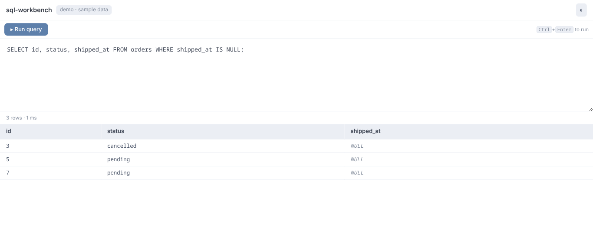
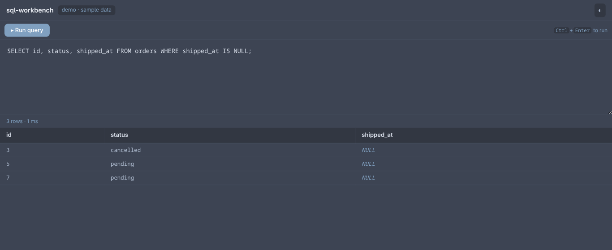

# SQL Workbench

**Practice SQL in your browser. Real SQLite, no install, no account — your data never leaves the tab.**

| Light | Dark |
| --- | --- |
|  |  |

**Try it:** https://udit-001.github.io/sql-workbench/ · or `npm install && npm run dev`

## What you get

- **Write and run real SQL** — a full SQLite engine compiled to WebAssembly runs in the page. Window functions, CTEs, joins: it's SQLite, not a toy parser.
- **Learn from your mistakes** — errors are explained in plain language; mistype a column (`c.regio`) and it asks if you meant `region`.
- **See the schema before you guess** — a sidebar lists every table and column (click to insert at the caret), and a diagram draws the tables with their foreign-key graph.
- **Bring your own data** — import a CSV and query it like any other table. A sample e-commerce dataset (customers → orders → products) is built in.
- **Keep a query journal** — every run is saved to history in your browser; export the whole session as Markdown when you're done.
- **Drop it into any page** — the whole bench is a single-file web component that picks up the host page's theme. Details below.

## Use it in your app

The bench compiles to one JavaScript file with no side requests: editor, SQLite engine (wasm), schema tools, and journal all inline. Load it and drop in the element:

```html
<script type="module"
        src="https://cdn.jsdelivr.net/gh/udit-001/sql-workbench@v0.2.0/dist-component/sql-workbench.js"></script>

<sql-workbench db="my-app" style="display:block;height:560px"></sql-workbench>
```

Prefer vendoring? Download `sql-workbench.js` from the [releases](https://github.com/udit-001/sql-workbench/releases) and serve it yourself.

### Attributes

| Attribute | Value | Notes |
| --- | --- | --- |
| `mode` | `card` | drill variant: editor + Run/Reset only (live-reactive) |
| `theme` | `light` \| `dark` | explicit override; omit to follow the host page (live-reactive) |
| `db` | any name | storage namespace: separate journal + imported tables per value (read at connect) |
| `fixture` | dataset id | load a fixture instead of the built-in demo (read at connect) |

### API

```js
const bench = document.querySelector("sql-workbench");
await bench.run("SELECT * FROM orders LIMIT 5");  // → Outcome, journaled
await bench.reset();                               // re-seed the dataset
const md = await bench.exportMarkdown();           // session journal as Markdown
bench.setTheme("dark");
bench.addEventListener("workbench-event", (e) => {
  // e.detail: { type: "query" | "dataset-reset" | "csv-import", ... }
});
```

### Theming

Three layers, from zero-config to pixel-level:

1. **Auto-adapt** — the bench follows the host page's `html[data-theme]`, the OS `prefers-color-scheme`, and (if a parent frame sends one) a `{ type: "theme", theme: "light" | "dark" }` postMessage. Embedded benches never write your theme keys.
2. **Token overrides** — every design token is a `--wb-*` custom property; set them on the element and they win the cascade, even against dark mode:

   ```css
   sql-workbench {
     --wb-bg: #24283b; --wb-surface: #1f2335; --wb-accent: #bb9af7;
     --wb-text: #c0caf5; --wb-heading: #7aa2f7; --wb-border: #414868;
     /* also: --wb-err, --wb-ok, --wb-kw/--wb-str/--wb-num/--wb-com (SQL
        syntax colors), --wb-mono, --wb-muted, --wb-divider, --wb-err-bg */
   }
   ```

3. **Parts** — `editor`, `run-button`, `reset-button`, `results`, `schema`, `diagram`, `history`, `statusbar`:

   ```css
   sql-workbench::part(run-button) { border-radius: 999px; }
   ```

### Data & privacy

Everything runs client-side: SQLite lives in the tab (memory DB), the journal and imported CSVs live in IndexedDB under the `db` namespace. No server, no telemetry.

## Development

```sh
npm install
npm run dev             # standalone app at localhost:5173
npm test                # vitest, 88 tests
npm run typecheck       # tsc --noEmit
npm run build           # standalone dist/
npm run build:component # single-file dist-component/sql-workbench.js
```

Vite + TypeScript, with `@sqlite.org/sqlite-wasm` as the only runtime dependency. The engine, journal, CSV parser, and error explainer live in `src/bench-kit/` as small, independently tested modules.
